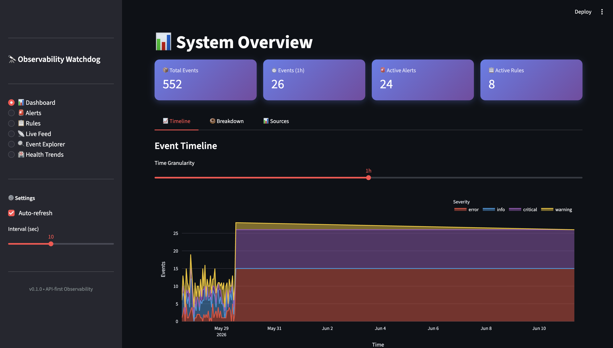

# Intelligent-Observability-Watchdog

An API-first intelligent observability platform that ingests, monitors, and alerts on system events from microservices — with a real-time Streamlit dashboard and automated breach detection.

---

### System Overview



## Features

- **Event Ingestion** — Single and batch event ingestion via REST API
- **Real-time Streaming** — WebSocket endpoint pushes new events to connected clients instantly
- **Alert Rules Engine** — Configurable threshold-based rules (e.g., `count > 10 in 5m`)
- **Watchdog** — Evaluates rules against recent events, detects breaches, records health snapshots
- **Interactive Dashboard** — Live feed, charts, alert management, rules CRUD, health trends
- **Breach Simulation** — Script to inject burst events and test the full alerting pipeline

---

## Architecture

```
┌─────────────────────────────────────────────────────────────────────┐
│                        Microservices                                │
│  payment-service │ auth-service │ api-gateway │ user-service │ ...  │
└────────────────────────────┬────────────────────────────────────────┘
                             │ POST /api/v1/events
                             ▼
┌─────────────────────────────────────────────────────────────────────┐
│                        FastAPI Backend                              │
│                                                                     │
│  ┌─────────────────┐  ┌─────────────────┐  ┌──────────────────┐     │
│  │  Events Router  │  │  Alerts Router  │  │   State Router   │     │
│  │  /api/v1/events │  │  /api/v1/alerts │  │  /api/v1/state   │     │
│  └────────┬────────┘  └────────┬────────┘  └────────┬─────────┘     │
│           │                    │                     │              │
│           └────────────────────┼─────────────────────┘              │
│                                ▼                                    │
│           ┌────────────────────────────────────────┐                │
│           │         SQLAlchemy ORM + SQLite         │               │
│           │  events │ alert_rules │ alerts          │               │
│           │  health_snapshots │ webhook_logs        │               │
│           └────────────────────────────────────────┘                │
│                                                                     │
│  ┌─────────────────────┐     ┌──────────────────────────────────┐   │
│  │  WebSocket Manager  │     │  Watchdog Router                 │   │
│  │  /ws/events         │     │  /api/v1/watchdog/run            │   │
│  │                     │     │  /api/v1/watchdog/health-snapshots│  │
│  │  Broadcasts new     │     │  /api/v1/watchdog/webhook-logs   │   │
│  │  events to all      │     │                                  │   │
│  │  connected clients  │     │  ┌────────────────────────────┐  │   │
│  └──────────┬──────────┘     │  │   Watchdog Engine          │  │   │
│                              │  │   • Parse conditions       │  │   │
│                              │  │   • Count recent events    │  │   │
│                              │  │   • Create alerts on breach│  │   │
│                              │  │   • Record HealthSnapshot  │  │   │
│                              │  │   • Log WebhookLog entries │  │   │
│                              │  └────────────────────────────┘  │   │
│                              └──────────────────────────────────┘   │
└─────────────────────────────────────────────────────────────────────┘
            
            
┌──────────────────────────────────────────────────────────────────────┐
│                     Streamlit Dashboard                              │
│                                                                      │
│  api_client.py (httpx) ◄──── REST polling (3–60s) ────► FastAPI      │
│                         ◄──── WebSocket stream    ────► /ws/events   │
│                                                                      │
│  ┌──────────┐ ┌────────┐ ┌────────┐ ┌──────────┐ ┌─────────────┐     │
│  │Overview  │ │Alerts  │ │ Rules  │ │Live Feed │ │   Health    │     │
│  │📊 Charts │ │🚨 Mgmt  │ │📋 CRUD │ │📡 Stream │ │ 🏥 Trends    │     |
│  └──────────┘ └────────┘ └────────┘ └──────────┘ └─────────────┘     │
└──────────────────────────────────────────────────────────────────────┘
```

### Request Flow

```
1. Service  ──POST /events──►  FastAPI  ──► SQLite (persist)
                                       └──► WebSocket broadcast ──► Dashboard

2. Watchdog ──evaluate rules──► count events in window
                             ├── breach? ──► create Alert + WebhookLog + HealthSnapshot
                             └── no breach ──► record HealthSnapshot only

3. Dashboard ──REST poll──► GET /events, /alerts, /state, /watchdog/*
             ──WS connect──► receive new events in real time

4. User ──acknowledge/resolve──► PATCH /alerts/{id}/status ──► SQLite update
```

---

| Layer | Technology |
|-------|-----------|
| Backend API | FastAPI 0.115, Python 3.11+ |
| Database | SQLite via SQLAlchemy 2.0 ORM |
| Real-time | WebSocket (FastAPI native) |
| Dashboard | Streamlit + Plotly + Pandas |
| HTTP Client | httpx |
| Config | pydantic-settings |
| Scheduling | APScheduler |
| Testing | pytest + FastAPI TestClient |
| Linting | Ruff |

---

## Project Structure

```
intelligent_observability/
├── app/
│   ├── config.py            # Settings via pydantic-settings
│   ├── database.py          # SQLAlchemy engine & session
│   ├── main.py              # FastAPI app, CORS, WebSocket, router registration
│   ├── models.py            # ORM models (Event, AlertRule, Alert, HealthSnapshot, WebhookLog)
│   ├── schemas.py           # Pydantic request/response schemas
│   ├── watchdog.py          # Watchdog engine — rule evaluation & breach detection
│   └── routers/
│       ├── events.py        # Event ingestion & query endpoints
│       ├── alerts.py        # Alert rules CRUD & alert management
│       ├── state.py         # System state summary
│       └── watchdog.py      # Watchdog trigger, health snapshots, webhook logs
├── dashboard/
│   ├── api_client.py        # httpx client wrapping all API calls
│   ├── app.py               # Streamlit entry point & sidebar navigation
│   └── pages/
│       ├── overview.py      # KPI metrics, event timeline, severity charts
│       ├── alerts_page.py   # Alert management with acknowledge/resolve actions
│       ├── rules_page.py    # Alert rules CRUD UI
│       ├── live_feed.py     # 3-second polling live event stream
│       ├── event_explorer.py # Search, filter, paginate events with charts
│       └── health_trends.py # Watchdog control, health charts, webhook logs
├── tests/
│   ├── conftest.py          # Test fixtures & isolated DB setup
│   ├── test_events.py       # Event API tests
│   ├── test_alerts.py       # Alert API tests
│   └── test_state.py        # State API tests
├── seed_data.py             # Synthetic data generator
├── simulate_breach.py       # Breach simulation script
└── pyproject.toml           # Project config & dependencies
```

---

## Getting Started

### Prerequisites

- Python 3.11+
- [uv](https://docs.astral.sh/uv/) (recommended) or pip

### Install uv

```bash
curl -LsSf https://astral.sh/uv/install.sh | sh
```

### Install dependencies

```bash
uv sync
```

### Seed the database

```bash
uv run python seed_data.py
```

Generates 500 synthetic events across 8 microservices, 8 alert rules, and 30 triggered alerts.

### Start the API server

```bash
uv run uvicorn app.main:app --reload
```

API available at: http://localhost:8000  
Interactive docs: http://localhost:8000/docs

### Start the dashboard

```bash
uv run streamlit run dashboard/app.py
```

Dashboard available at: http://localhost:8501

### Simulate a breach

```bash
uv run python simulate_breach.py
```

Injects burst events to trigger alert rules and runs the watchdog cycle.

---

## API Endpoints

### Events

| Method | Endpoint | Description |
|--------|----------|-------------|
| `POST` | `/api/v1/events/` | Ingest a single event |
| `POST` | `/api/v1/events/batch` | Ingest multiple events |
| `GET` | `/api/v1/events/` | Query events (filter by source, type, severity, time range) |
| `GET` | `/api/v1/events/{id}` | Get event by ID |

### Alerts & Rules

| Method | Endpoint | Description |
|--------|----------|-------------|
| `POST` | `/api/v1/alerts/rules` | Create an alert rule |
| `GET` | `/api/v1/alerts/rules` | List all alert rules |
| `PATCH` | `/api/v1/alerts/rules/{id}` | Update a rule |
| `DELETE` | `/api/v1/alerts/rules/{id}` | Delete a rule |
| `GET` | `/api/v1/alerts/` | List triggered alerts |
| `PATCH` | `/api/v1/alerts/{id}/status` | Acknowledge or resolve an alert |

### System & Watchdog

| Method | Endpoint | Description |
|--------|----------|-------------|
| `GET` | `/api/v1/state/` | System state summary |
| `POST` | `/api/v1/watchdog/run` | Trigger a watchdog evaluation |
| `GET` | `/api/v1/watchdog/health-snapshots` | Get health trend data |
| `GET` | `/api/v1/watchdog/webhook-logs` | Get webhook delivery logs |
| `WS` | `/ws/events` | Real-time event stream |

---

## Dashboard Pages

| Page | Description |
|------|-------------|
| 📊 Dashboard | KPI metrics, event timeline, severity/type breakdowns, source chart |
| 🚨 Alerts | Alert status distribution, filterable alert cards, acknowledge/resolve actions |
| 📋 Rules | Create, search, enable/disable, delete alert rules |
| 📡 Live Feed | 3-second auto-refresh event stream with severity filtering |
| 🔍 Event Explorer | Full-text search, multi-filter, timeline/heatmap charts, paginated table |
| 🏥 Health Trends | Watchdog trigger, health trend charts, webhook logs, breach history |

---

## Data Models

### Event
Represents an observability event from a service.

| Field | Type | Description |
|-------|------|-------------|
| `source` | String | Service name (e.g., `payment-service`) |
| `event_type` | String | Type of event (e.g., `http_error`, `cpu_spike`) |
| `severity` | Enum | `info` / `warning` / `error` / `critical` |
| `message` | Text | Human-readable description |
| `metadata_json` | Text | JSON blob with additional context |
| `timestamp` | DateTime | When the event occurred |
| `created_at` | DateTime | When the record was inserted |

### AlertRule
Defines a threshold condition to watch for.

| Field | Type | Description |
|-------|------|-------------|
| `name` | String | Unique rule name |
| `description` | Text | What the rule detects |
| `event_type` | String | Event type to monitor |
| `severity_threshold` | Enum | Minimum severity to match |
| `condition` | Text | Threshold expression (e.g., `count > 10 in 5m`) |
| `enabled` | Boolean | Whether the rule is active |
| `created_at` | DateTime | When the rule was created |
| `updated_at` | DateTime | When the rule was last modified |

### Alert
A triggered instance of a rule breach.

| Field | Type | Description |
|-------|------|-------------|
| `rule_id` | Integer | Reference to the AlertRule |
| `status` | Enum | `active` / `acknowledged` / `resolved` |
| `message` | Text | Breach description with event counts |
| `triggered_at` | DateTime | When the breach was detected |
| `acknowledged_at` | DateTime | When acknowledged (nullable) |
| `resolved_at` | DateTime | When resolved (nullable) |

### HealthSnapshot
A point-in-time snapshot of system health recorded each watchdog cycle.

| Field | Type | Description |
|-------|------|-------------|
| `timestamp` | DateTime | When the snapshot was taken |
| `total_events_1h` | Integer | Total events in the last hour |
| `error_count_1h` | Integer | Error-severity events in the last hour |
| `critical_count_1h` | Integer | Critical-severity events in the last hour |
| `active_alerts` | Integer | Number of currently active alerts |
| `breaches` | Integer | Number of breaches detected in this cycle |

### WebhookLog
Records each webhook notification attempt made on a breach.

| Field | Type | Description |
|-------|------|-------------|
| `alert_id` | Integer | Reference to the triggered Alert |
| `rule_name` | String | Name of the rule that breached |
| `status_code` | Integer | HTTP status code of the webhook response |
| `delivered` | Boolean | Whether delivery succeeded |
| `response_body` | Text | Response payload from the webhook endpoint |
| `created_at` | DateTime | When the notification was sent |

---

## Alert Lifecycle

```
ACTIVE ──► ACKNOWLEDGED ──► RESOLVED
```

Manage transitions from the Alerts dashboard page or via `PATCH /api/v1/alerts/{id}/status`.

---

## WebSocket Integration

Connect to `ws://localhost:8000/ws/events` to receive new events in real time as they are ingested.

```python
import asyncio, websockets, json

async def listen():
    async with websockets.connect("ws://localhost:8000/ws/events") as ws:
        while True:
            msg = await ws.recv()
            event = json.loads(msg)
            print(f"[{event['data']['severity']}] {event['data']['message']}")

asyncio.run(listen())
```

---

## Development Workflow

### Run tests

```bash
uv run pytest
```

37 tests covering event ingestion, alert rule CRUD, alert lifecycle, and system state.

### Lint

```bash
uv run ruff check .
```

### Lint with auto-fix

```bash
uv run ruff check . --fix
```

### Format code

```bash
uv run ruff format .
```

---

## Pre-configured Alert Rules

| Rule | Condition | Severity |
|------|-----------|----------|
| High Error Rate | `count > 10 in 5m` on `http_error` | error |
| DB Connection Crisis | `count > 3 in 2m` on `db_connection_timeout` | critical |
| Latency Degradation | `count > 5 in 10m` on `high_latency` | warning |
| Memory Pressure | `count > 2 in 3m` on `memory_threshold` | critical |
| CPU Overload | `count > 3 in 5m` on `cpu_spike` | error |
| Disk Space Critical | `count > 1 in 1m` on `disk_full` | critical |
| Brute Force Detection | `count > 5 in 2m` on `auth_failure` | warning |
| Rate Limit Breach | `count > 3 in 5m` on `rate_limit_exceeded` | warning |
